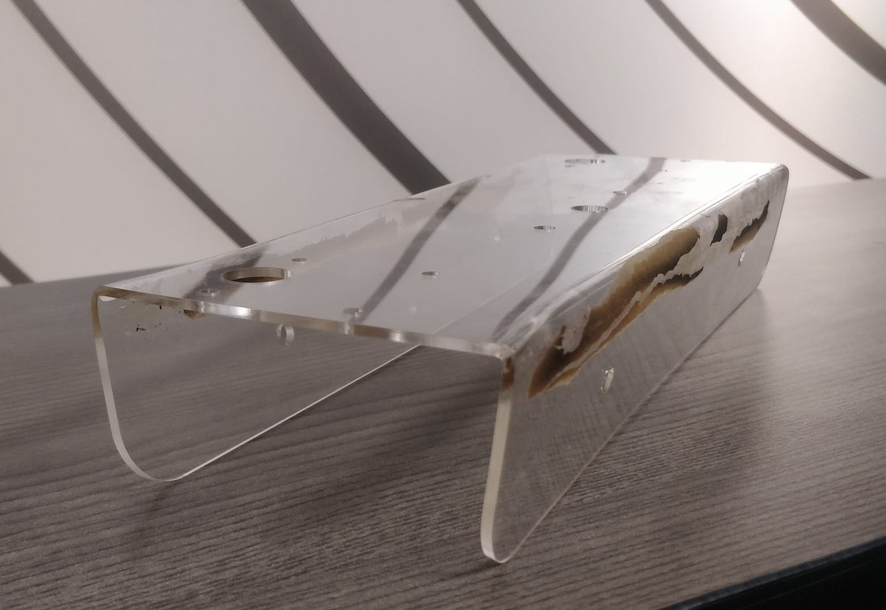

# Building the AgBot
Follow the steps below to build the AgBot. 

This guide contains the physical assembly of the AgBot, the circuit diagrams and the code for the Arduino Uno and the Raspberry Pi.

# Assembling the Chasis
For this project, we created the frame of our robot using Acrylic Chassis. In total, we used laser cutter to create four of them to create the body, with several openings for the motor axes and screws

The chassis looks like this: <br>
<center>

</center>

Two of them has their length side bent 90 degrees to create the side chassis. It was bent at a distance of 54 mm from each ends of the breadth. The side chassis look like:
<center>

</center>
Joining the two side chassis with the other two chassis, we obatain the same structure as the one shown in the image:
<center>

</center>
<br>

_Top chassis is not shown in the image_

# Creating the Motor Ciruit
Now, we begin creating the circuit for the motors.

The polarity for a particular motors can be found by connecting it to a 12V battery. If the motor rotates in the desired direction, the polarity is correct. Otherwise, the polarity needs to be reversed. 

By syncing the directions of the motors, first pairwise, we connect both the pairs and if the directions for both the pairs are desired, we connect them to the H-Bridge otherwise we reverse the paired polarity as well. 

Overall, the circuit looks like this:
<center>

</center>
We now attach the motors to the chassis using screws and the wheels to the motor axis using screws. It should look similar to the image above in the assembly section.


_The polarities for the motors might be different from the ones shown in the diagram. We connect with the battery only to check the polarities. Other than that, we keep the battery disconnected._
# Creating the H-Bridge Circuit
Now, as we have the motor circuit ready, we need to connect it to the H-Bridge. We are using the IBT-2 H-Bridge for this project. 

We would first connect two H-Bridges to an Arduino Uno. The circuit for the H-Bridge is as follows:
<center>

</center>
The pin layout for the H-Bridge can also be referred from the H-Bridge Arduino Code in the repository.

After connecting the H-Bridge to the Arduino Uno, we connect the motors to the H-Bridge. The circuit for the H-Bridge is as follows:
<center>

</center>

The motors are connected to the M+ and M- pins of the H-Bridge while the battery is connected to the B+ and B- pins of the H-Bridge.

**Make sure the M and B pins are completely inside the pin holes to avoid short-circuiting.**

The polarities of the pair of motors connected to the H-Bridge should be the same. If not, the connections to the H-Bridge should be reversed.
# Motor Code on Uno
## Writing the Code
We begin the code by defining the pins for the H-Bridge and the Arduino Uno. The pins for the H-Bridge are defined as follows:
```c
#define lft_R_IS 4
#define lft_R_EN 2
#define lft_R_PWM 5
```
and so on for the other pins. We then define a ```char``` variable which would receive input from the Raspberry Pi we would be using to control the AgBot. 

In our setup function, we are defining the pins as output pins and setting the PWM frequency for the PWM pins. We are also setting the ```Serial``` communication at a baud rate of 9600.

We begin writing direction functions for the motors by writing on the PWM analog pins. We write the speed we want for the motors in the pins, which ranges from 0 to 255. For the functions, we have used the ```int``` variable ```pwmcycle``` as the formal parameter. 

**It is very important that both values for R_PWM and L_PWM for each H-Bridge are NOT non-zero.**

The one of the function is as follows:
```c
void direction_1(int pwmcycle) {
   analogWrite(rgt_R_PWM, pwmcycle);
   analogWrite(rgt_L_PWM, 0); 
   analogWrite(lft_R_PWM, pwmcycle);
   analogWrite(lft_L_PWM, 0);                 
}
```
We then write the code for other direction functions by using different combinations of the PWM pins, keeping in mind that no two PWM pins for the same H-Bridge have non-zero values.

After writing the direction functions, we write the code for the ```loop``` function. We begin by reading the ```char``` variable ```fromPi``` which would store input from the Raspberry Pi by using ```Serial.Read()``` . We then write a ```if-else``` functions to call the direction functions based on the input received. For now, we put any direction function for any input.

We will use the ```F-B-R-L``` convention for the directions and ```S``` for stopping the motors. This convention is not necessary and any can be used as long as the same convention is used in the Raspberry Pi code.

In the end of the ```loop``` function, we write ```Serial.flush()``` to clear the buffer from the previous input.

## Configuration
We can now upload the code to the Arduino Uno and connect to our laptop. We can use the Serial Monitor to check if the code is working properly. We can also use the Serial Monitor to control the motors by sending the input from the Serial Monitor.

Since we used our direction functions under the switch function, we send the input from the Serial Monitor as ```F```, ```B```, ```R```, ```L``` and ```S``` to move the motors forward, backward, right, left and stop respectively. If the motors are moving in a particular direction when called one of the functions, we rename the function to the corresponding direction and put that direction in the if-else function.

So the function that was previously named ```direction_1``` would be renamed to ```right```. 

The code in the ```loop``` function for this direction would look like this:
```c
if (fromPi== 'R') {
      right(255);
    }
```

The same block of code could be different for different AgBots and depends on the motor circuit configuration. Hence the testing by sending input to check the direction of the motors is necessary.
# Serial Control Code on Raspberry Pi
Before we begin writing the code for the Raspberry Pi, please ensure that it is properly configured and connected to the internet so that we can use ```ssh``` to connect to it from our laptops.

Additionally, please ensure that the ```serial``` library is installed on the Raspberry Pi. If not, we first uninstall the old version and then install the newer version by using the following command:
```bash
pip3 uninstall serial
pip3 install pyserial
```

We will also use the ```curses``` library, which usually comes pre-installed with Python in Linux. If not, we can install it by using the following command:
```bash
pip3 install curses
```
If everything is in order, we can ```ssh``` into the Raspberry Pi by using the following command:
```bash
ssh pi@<ip-address>
```
We can find the IP address of the Raspberry Pi by using the ```ifconfig``` command in the terminal of the Raspberry Pi.
## Writing the Code
We will use Python to write the code for the Raspberry Pi. 

We begin by importing the ```serial``` library to establish serial communication with the Arduino Uno. We then define the ```Serial``` object by using the ```serial.Serial()``` function. We pass the port name and the baud rate as the parameters. The port name can be found by using the ```ls /dev/tty*``` command in the terminal of the Raspberry Pi. For newer Arduino Uno boards, the port name is ```/dev/ttyACM0``` while for the older ones, it is ```/dev/ttyUSB0```. 

The baud rate should be the same as the one used in the Arduino Uno code.

We then import the ```curses``` library to use the keyboard to control the AgBot. We define the ```screen``` variable by using the ```curses.initscr()``` function. We then use the ```curses.noecho()``` function to disable the displaying of the keys pressed and ```curses.cbreak()``` function to disable the line buffering so that the keys pressed are immediately sent to the Raspberry Pi. We then use the ```screen.keypad(True)``` function to enable the keypad mode. 

Then, we write a ```try``` block to write the code for the ```loop``` function. We begin by writing under a ```While True``` loop and defining a variable which stored the value received from the ```screen.getch()``` function. We then write a ```if-else``` function to send the input to the Arduino Uno based on the key pressed. We use the ```Serial.write()``` function to send the input to the Arduino Uno. **Use the same convention as used in the Arduino Uno code.**

The code for the ```loop``` function would look like this:
```python
try:
  while True:
    char = screen.getch()
    if char == ord('q'):
      break
    elif char == curses.KEY_UP:
      arduino.write(b'F') # this sends 'F' to arduino. 
      # Use whatever convention/key you have decided for each direction
```
We then write the code for the ```finally``` block to close the ```screen``` variable and the ```Serial``` object. We also use the ```curses.nobreak()``` function to disable the keypad mode and the ```curses.echo()``` function to enable the displaying of the keys pressed. In the end, we use the ```curses.endwin()``` function to close the window and close the serial communication by using the ```.close()``` method for the Serial object.
## Configuration
Now, we connect the Arduino Uno to the Raspberry Pi using the USB cable and run the code on the Raspberry Pi using the following command:
```bash
python3 <filename>.py
```
We can now use the keypad to control the AgBot. By sending in the input from the keypad, we can check if the motors are moving in the desired direction. If not, we can change the direction in the code and re-run the code.
# Image Analysis from Raspberry Pi
## Setting up Motion
We will use the ```motion``` library to access the camera feed from the Raspberry Pi. We will also use the ```cv2``` library to analyse the feed and mask the green color from the feed.

We first install the service in the Raspberry Pi by using the following command:
```bash
sudo apt-get install motion
```
To ensure that the camera is properly detected, enter the command 'lsusb' and press enter. This command will display the name of your camera. If you do not see the camera's name, it indicates a problem with the camera or that it is not supported in the 'motion' software.

Once its done, we can now configure the ```motion``` service. We can do this by editing the ```motion.conf``` file. We can do this by using the following command:
```bash
 sudo nano /etc/motion/motion.conf 
```
For now, we put the following values in the file:
```Daemon: On
Width: 640
Height: 480
Framerate: 1500
Output images: on
Quality: 100
Stream_quality: 100
Stream_maxrate: 30
Stream_localhost: off
Webcontrol_localhost: off
```
You can change the values as per your requirements.

Now, enter the following:
```bash
sudo nano /etc/default/motion
```
and set ```start_motion_daemon``` to ```yes```.

We can restart the service and activate it from the following command:
```bash
sudo service motion restart
sudo motion
```
## Displaying the camera feed
Using the ```paramiko``` library, we can access the camera feed from the Raspberry Pi. We begin by importing the ```paramiko``` library. We then define the ```SSHClient``` object by using the ```paramiko.SSHClient()``` function. We then use the ```SSHClient.set_missing_host_key_policy(paramiko.AutoAddPolicy())``` function to add the host key to the ```SSHClient``` object. We then use the ```SSHClient.connect()``` function to connect to the Raspberry Pi. We pass the IP address, username and password as the parameters.

Now to access the camera from the Raspberry Pi, we would use the ```cv2``` library.

Using the ```cv2.VideoCapture()``` function, we define the ```capture``` variable to access the camera. We pass the camera number as the parameter. For the Raspberry Pi, the camera number is 0.

The camera feed can be displayed by visiting the following url in the browser: ```http://<ip-address>:8081```
The port number is 8081 by default.
## Masking
To capture the green color from the camera feed, we would use the ```cv2``` library and the ```numpy``` library to convert the image into a ```numpy``` array.

We will first analyse the green conent directly from the video feed and simultaneously, we will also analyse the green content from the video feed and display it alongside.

We will first import the following libraries:
```python
import cv2
import numpy as np
import paramiko
import datetime
import io
```

We first set up the SSH connection paramteres and connect to the Pi. We would now start reading the input being collected by the camera and do our analysis on that. We check if we successfully read a frame by seeing the value stored in the ```ret``` variable. If the value is ```True```, we would proceed with the analysis.

Since we want a constant feed as well as a constant analysis, we would write this part of the code in a ```while True``` loop. 

So this part of the code would look like this:
```python
ssh = paramiko.SSHClient()
# rest of the shh code
while True:
  ret, frame = capture.read()
  if ret not True:
    break
  # rest of the code
```

Now, as we stored on frame, we start our analysis on it. 

We define the lower and upper green color thresholds in HSV color space using arrays. These values represent the range of green hues that will be considered in the mask. Pixels within this range will be set to white (255) in the mask, while pixels outside this range will be set to black (0).

Addtionally, the captured frame is in BGR Colour Space. We convert it to HSV Colour Space using the ```cv2.cvtColor()``` function. 

So far, this is how the analysis looks like inside the ```while True``` loop after capturing the frame:
```python
lower_green = np.array([40, 40, 40])
upper_green = np.array([70, 255, 255]) # setting the lower and upper green color thresholds

hsv_frame = cv2.cvtColor(frame, cv2.COLOR_BGR2HSV) # converting to HSV
```

We then use the ```cv2.inRange()``` function to create a mask and store in a variable ```green_mask```. We pass the frame, the lower and upper green color thresholds as the parameters. We then calculate the number of green pixels using ```np.sum``` and total pixels using ```green_mask.size```. Then, we calculate the percentage of green pixels in the frame by dividing the number of green pixels by the total number of pixels and multiplying by 100 and store it in a variable ```green_percentage```.

Finally, we display the mask with the original frame using ```cv2.imshow()```
```python
cv2.imshow('Video', frame)
cv2.imshow('Mask', green_mask)
```

Our feed is now ready. We can now run the code and check if the feed is working properly. If not, we can change the lower and upper green color thresholds and re-run the code.
## Sending images to Server
Now, we want to send the analysed images to the server, which in this case is also a Raspberry Pi. We will set up the receiving side of the server later.

To send an image, we first encode the green mask as a JPEG and create an in-memory file object using ```io.BytesIO``` and store it in a variable ```frame_file```. We set a directory path where we want to store the image and store it in a variable ```remote_directory```. 

Using the SSH object we defined in the beginning, we open an SFTP connection using ```ssh.open_sftp()``` and store as a variable ```sftp```. Then, using the ```sftp.putfo()``` function, we send the image to the server. We pass the frame and the _complete_ remote directory path, including the file name, as the parameters. We then close the SFTP connection using the ```sftp.close()``` function.

This is how the code would look like:
```python
frame_bytes = cv2.imencode('.jpg', green_mask)[1].tobytes()
frame_file = io.BytesIO(frame_bytes)

remote_directory = '/home/pi/Desktop/masks/'

sftp = ssh.open_sftp()
sftp.putfo(frame_file, remote_directory) # we have not yet defined the file name
sftp.close()
```

Let us send one masked image every 5 seconds. We will use the ```time``` library to do this. We will also use the ```io``` library to convert the image into a ```bytes``` object.

First, before our ```while True``` loop, we store the start time in a variable ```start_time```. 

Inside the loop, after our masked image is shown, we store the current time in a variable ```current_time``` and subtract the start time from it. As the code loops, the elapsed time would increase until it reaches our threshold. At that moment, the difference would be greater than 5 seconds. If that happens, the program would run the code we wrote for sending an image to the server.

We would also save the image as its timestamp so we can understand when that image was taken at. So, we save the current datetime as a string and store it in a variable ```remote_filename```, along with the JPEG extension.

While sending the image, we would concatenate the remote directory and the remote filename to get the complete remote directory path. We would then send the image to the server and close the SFTP connection. 

Do not forget to update the start time to the current time after sending the image so that the elapsed time is calculated from the current time.

The modified code would look like this:
```python
current_time = datetime.datetime.now()
  elapsed_time = current_time - start_time

  if elapsed_time.total_seconds() >= 1.0:
    timestamp = datetime.datetime.now().strftime("%Y%m%d_%H%M%S")
    remote_filename = f'frame_{timestamp}.jpg'

    frame_bytes = cv2.imencode('.jpg', green_mask)[1].tobytes()
    frame_file = io.BytesIO(frame_bytes)

    remote_directory = '/home/pi/Desktop/masks'
    sftp = ssh.open_sftp()
    sftp.putfo(frame_file, remote_directory + '/' + remote_filename)
    sftp.close()
    start_time = current_time
```
Add a check to break the loop if the 'q' key is pressed and close all the connections and windows in the end of the file.

```python
while True:
  # rest of the code
  if elapsed_time.total_seconds() >= 1.0:
    # rest of the code

  if cv2.waitKey(1) & 0xFF == ord('q'): # press 'q' to quit
    break # break the loop

# close all the connections and windows
capture.release() 
cv2.destroyAllWindows()
ssh.close()
```
# Setting up soil sensors
## Soil Sensor Circuit
We will be using the ESP32 to collect the soil data. We will be using the Breadboard Power Supply board for this.

The circuit looks like this:
<center>

</center>

**Please note that the backside of the power supply is shown to clearly see the connections**
## Send soil data to Raspberry Pi
Before we start sending the data, we need to start collecting it first. In our circuit, you can see we are using the ```VP``` pin, which has the pin number ```36``` on the ESP32. To collect the data, we simply do an ```analogRead(36)```.

Now, to send the data. The sensors have to send the data to the Client AgBots as well as the Server AgBot. We want our design to be such that the AgBot only starts receiving data when it is in a close proximity to the sensor while the server continuosly receives it irrespective of the proximity. To implement this, we decided that the client-ESP communication is done over Bluetooth and the server-ESP communication is done over WiFi. 

**We will send the data as a JSON object so ensure that the ```ArduinoJson``` library is installed on your Arduino IDE.**

For the server, it is necessary for a connection to not break. However, if we use the same logic for a client, it can cause problems because ESP32 can connect to only one device at a time, and that can cause hoarding of a sensor by the client, not allowing others to collect data.

To avoid this, we would introduce a timer interrupt, which would break the bluetooth connection between the client and ESP32 after a certain time interval. This would allow other clients to connect to the ESP32 and collect data.

To connect with your AgBots, ensure you have run the following commands on your Raspberry Pi:
```bash
sudo apt-get install bluetooth libbluetooth-dev
sudo python3 -m pip install pybluez
```
This is to ensure that the ```pybluez``` library is installed on your Raspberry Pi, which will be used to connect to the ESP32s via Bluetooth. 

### Client-ESP Communication
Before anything else, we first check if bluetooth is enabled in ESP32 or not. To do this, we write:
```c
#if !defined(CONFIG_BT_ENABLED) || !defined(CONFIG_BLUEDROID_ENABLED)
#error Bluetooth is not enabled! Please run `make menuconfig` to enable it
#endif
```
This is just a preprocessor directive often used in ESP32 projects to check if Bluetooth is enabled in the project configuration.

We will use Bluetooth Serial to communicate using bluetooth as it is the easiest way to do so. We begin by including the ```BluetoothSerial.h``` library and defining the name of the ESP32 as ```ESP32-West```. We then define a ```BluetoothSerial``` object. We also define an ```unsigned long``` variable ```startTime``` for storing time and a ```bool``` variable ```isConnected``` to check if the ESP32 is connected to a device or not. Initially, we set the value of ```isConnected``` to ```false```.

In the ```setup()``` function, we begin ```Serial``` with a baud rate of 115200. We also begin ```SerialBT``` and give the name of the ESP32 as the parameter. 

So far, the code would look like this:
```c
#include "BluetoothSerial.h"
#include <ArduinoJson.h>

#define ESP_NAME "ESP32-West"

// bluetooth check code

BluetoothSerial SerialBT;
unsigned long startTime;
bool isConnected = false;

// soil analysis part
int sensor_analog_value;
const int sensor_pin = 36;

void setup(){
    Serial.begin(115200);
    SerialBT.begin(ESP_NAME);
}
```
Now, for the ```loop()``` function, we begin by checking first if the ESP32 is already connected by checking the ```isConnected``` variable. If it is not connected, check if there is an incoming connection request from a Bluetooth device using ```SerialBT.connected()```. 

If a connection is detected, set the ```isConnected``` flag to true and record the current time using ```millis()```, which returns the number of milliseconds since the ESP32 started running and store it in the ```startTime``` variable.

If the ESP32 is already connected, check if the Bluetooth connection is lost. If the connection is lost, set the ```isConnected``` flag to false. If connection is still active, check if the time elapsed since the connection is established is greater than 20 seconds. If it is, close the connection using ```SerialBT.disconnect()``` and set the ```isConnected``` flag to false. 

Check if there is data available from the serial port. If there is data available, read a byte of data from the serial port using ```Serial.read()``` and send it to the Bluetooth device using ```SerialBT.write()```. Similarly, check if there is data available from the Bluetooth connection. If there is data available, read a byte of data from the Bluetooth connection using ```SerialBT.read()``` and send it to the serial port using ```Serial.write()```. We then put a small delay of 20 milliseconds to avoid overloading the ESP32.

So far, the code would look like this:
```c
void loop(){
    if(!isConnected){
        if(SerialBT.hasClient()){
            isConnected = true;
            startTime = millis();
        }
    } else {
        if(!SerialBT.connected()){
            isConnected = false;
        } else {
            if(millis() - startTime > 20000){
                SerialBT.disconnect();
                isConnected = false;
            }
        }
    }

    if(Serial.available()){
        SerialBT.write(Serial.read());
    }
    if(SerialBT.available()){
        Serial.write(SerialBT.read());
    }
    delay(20);
}
```
Now, we read the data from the soil sensor and send it to the Bluetooth device. We begin by reading the data from the soil sensor using ```analogRead()``` and store it in the variable ```sensor_analog```. We then create a ```StaticJsonDocument``` object ```Data``` with a capacity of 200 bytes. We then create a ```JsonObject``` object ```data``` and add the keys ```ESP_Name``` and ```Soil Moisture``` and add the corresponding the values ```sensor_analog_value``` to it. We then serialize the JSON object using ```serializeJson()``` function and store it in a string variable ```jsonString```. 

We then send the JSON data to the Bluetooth device using ```SerialBT.println()```. We then put a delay of 1000 milliseconds so that the data is sent every second.

Now, the code would look like this:
```c
void loop(){
    sensor_analog = analogRead(sensor_pin);
    StaticJsonDocument<128> Data;

    Data["ESP Name"] = ESP_NAME;
    Data["Soil Moisture"] = sensor_analog;

    String jsonString;
    serializeJson(Data, jsonString);

    SerialBT.println(jsonString);
    delay(1000);
}
```
The soil data is successfully sent to the client AgBot.
### Server-ESP Communication
Since we are sending the data to the server over WiFi, we will also include the ```WiFi.h``` library to connect to the WiFi and the ```WiFiUdp.h``` library to send the data over UDP. 

We define ```char *``` variables to set our WiFi SSID, password and IP of the server and ```int``` variable to set the port number. 
. We then define a ```WifiUDP``` object called ```udp```.

Now, inside the ```void setup()```, begin the WiFi connection using ```WiFi.begin()``` and pass the SSID and password as the parameters. using a ```while``` loop, we wait until the Wi-Fi connection is successfully established. After the connection is established, we begin the UDP connection using ```udp.begin()``` and pass the port number as the parameter.

So far, the code would look like this:
```c
#include "BluetoothSerial.h"
#include <ArduinoJson.h>
#include <WiFi.h>
#include <WiFiUdp.h>

// other definations done in the client-esp part

char *ssid = ""; // wifi ssid
char *password = ""; // wifi password
char *server_ip = ""; // server ip
int port = 1234;

WiFiUDP udp;

void setup(){
    // other setup done in the client-esp part

    WiFi.begin(ssid, password);
    while(WiFi.status() != WL_CONNECTED){
        delay(1000);
    }
    udp.begin(port);
}
```
In the loop section, since we have already collected data for sending to client, we simply send the same to the server using ```udp```. We first begin a ```udp.beginPacket()``` and pass the server IP and port number as the parameters. We then send the data using ```udp.print()``` and end the packet using ```udp.endPacket()```. 

Now, the code for the ```loop()``` function would look like this:
```c
void loop(){
    // other loop code done in the client-esp part

    udp.beginPacket(server_ip, port);
    udp.print(jsonString);
    udp.endPacket();

    delay(1000); // same delay as the client-esp part
}
```
The soil data is successfully sent to the server AgBot.
# Setting up Client-side AgBots
These AgBots will receive the data from the Soil Sensors controlled by ESP32 and collect their mask images. They will then send all of this to the server every 2 minutes.
## To Server AgBot
To send the data to the server, we will be using ```sockets```. We will be sending the data as a JSON object. We will be using the ```socket``` library to establish the connection and the ```json``` library to convert the data to JSON. We will also be using the ```base64``` library to encode the images as base64 strings, the ```os``` library to get the file paths and the ```time``` library to set the time interval for sending the data. 
```python
import socket
import time
import os
import json
import base64
```
We first define the IP and Port for the server, along with the directory path where we want to store the masks and the soil data. We also store a name for the AgBot in the ```username``` variable.
```python
server_ip = ''  # Server IP
server_port = 1235 

directory_path = 'masks' 
csv_file_path = './soil-data/received_data.csv'  
username = ''  # Replace with the desired username
```
Now, we write out code inside a ```while True``` loop to keep sending the data to the server. We begin by creating a socket object using the ```socket.socket()``` function and connect to the server. We define an empty dictionary ```data``` , where we put 'username' as key and the ```username``` as value.

We open our CSV as a file object and read the data using the ```read()``` function. We then encode the data as base64 string using the ```base64.b64encode()``` function and store it in a variable ```csv_data```. 
```python
with open(csv_file_path, 'rb') as csv_file:
    csv_data = csv_file.read()
    data['csv'] = base64.b64encode(csv_data).decode()
```
We create an empty list ```images``` to store the base64-encoded images. We then iterate through the files in the ```directory_path``` directory and read the data using the ```read()``` function. We then encode the data as base64 string using the ```base64.b64encode()``` function and append it to the ```images``` list. The ```images``` list is then added to the ```data``` dictionary with the key ```images```. 
```python
images = []
for file_name in os.listdir(directory_path):
    image_path = os.path.join(directory_path, file_name)
    with open(image_path, 'rb') as image_file:
        image_data = image_file.read()
    encoded_image_data = base64.b64encode(image_data).decode()
    images.append(encoded_image_data)
data['images'] = images
```


Finally, this dictionary is converted to a JSON object using the ```json.dumps()``` function and stored in a variable ```json_data``` which is then sent using ```socket.send()``` function. We then close the socket connection using the ```socket.close()``` function and sleep for 2 minutes using the ```time.sleep()``` function, after which the loop repeats.

## From ESP32
We will be receiving the JSON data from the ESP32s using bluetooth using ```sockets``` and store as CSV. We import the following:
```python
import bluetooth
import time
import json
import csv
from datetime import datetime
```
For the client AgBots, since they are receiving data for the ESP32s in their proximity, they can save that data with the file path of their choice. For this instance, we will be setting the ```csvLocation``` as ```home/pi/Desktop/soil_data/received_data.csv```.

Now, we store the names of our ESP32in a list ```esp_names```. For now, we have only 4 sensors, which are named as "ESP32-North", "ESP32-South", "ESP32-East" and "ESP32-West" and will be spread out in the field in the respective directions. So, we will store these names in the list.

Now, we need the MAC addresses of the ESP32s, and to collect them, we will define a function ```find_esp32_mac_address()``` with ```esp32_device_name``` as a parameter. We will use the ```bluetooth.discover_devices()``` function to discover the devices in the proximity and store them in a list ```nearby_devices```. We then iterate through the list and check if the device name matches the ```esp32_device_name``` parameter. If it does, we return the MAC address of the device, otherwise returns ```None```. The function would look like this:
```python
def find_esp32_mac_address(esp32_device_name):
    nearby_devices = bluetooth.discover_devices(duration=8, lookup_names=True, flush_cache=True, lookup_class=False)

    for device_address, device_name in nearby_devices:
        if device_name == esp32_device_name:
            return device_address

    return None
```
We will also define a function ```connect_to_esp32()``` with parameter ```esp32_device_name``` for connecting to the ESP32 so they can send data. We will first call the ```find_esp32_mac_address()``` function to get the MAC address of the ESP32 and store it in a variable ```esp32_mac_address```.  If the address is not none, we use the ```bluetooth.BluetoothSocket()``` function to create a socket object and store it in a variable ```esp32_socket```. We then use the ```esp32_socket.connect()``` function to connect to the ESP32. We pass the MAC address as the parameter. We then return the socket object if connected, otherwise ```None```. The function would look like this:
```python
def connect_to_esp32(esp32_device_name):
    esp32_mac_address = find_esp32_mac_address(esp32_device_name)
    if esp32_mac_address:
        sock = bluetooth.BluetoothSocket(bluetooth.RFCOMM)
        port = 1  # RFCOMM port number

        try:
            sock.connect((esp32_mac_address, port))
            print(f"Connected to {esp32_device_name}")
            return sock
        except Exception as e:
            print(f"Failed to connect to {esp32_device_name}: {e}")
            return None
    else:
        print("ESP32 device not found.")
        return None
```

Now, we define a function ```receive_serial_data()``` with parameter ```sock``` to receive the data from the ESP32. We first define a variable ```data``` to store the data received from the ESP32. We then use the ```sock.recv()``` function to receive the data and store it in the ```data``` variable. We then decode the data from bytes to string using the ```decode()``` function and remove the leading and trailing whitespace using the ```strip()``` function. 

If the resulting string is not empty, we use ```json.loads()``` function to parse the string as a JSON and store it in a variable ```data_json```. From that, we extract the values for the keys ```ESP Name``` and ```Soil Moisture``` and store them in variables ```esp_name``` and ```soil_moisture``` respectively. We also save the current timestamp as a string in a variable ```timestamp```. Finally, we write these as a row in the CSV file using the ```csv.writer()``` function in the order "timestamp", "esp_name" and "soil_moisture". The function would look like this: We put this code under a ```try``` block and write the code for the ```except``` block to handle any errors, and this whole block in a ```while True``` loop to keep receiving data from the ESP32s. 

The code would look like this:
```python
def receive_serial_data(sock):
    while True:
        try:
            data = sock.recv(1024)
            if data:
                data_str = data.decode().strip()
                if data_str != '':
                    print(f"Received data: {data_str}")
                    data_json = json.loads(data_str)

                    esp_name = data_json.get("ESP Name", "")
                    soil_moisture = data_json.get("Soil Moisture", "")
                    timestamp = datetime.now().strftime("%Y-%m-%d %H:%M:%S")

                    csv_row = [timestamp, esp_name, soil_moisture]
                    with open(csvLocation, "a", newline="") as csvfile:
                        csv_writer = csv.writer(csvfile)
                        csv_writer.writerow(csv_row)

        except Exception as e:
            print(f"Error receiving data: {e}")
            break
```
Finally, we run the code by calling the functions in the ```main``` function as follows:
```python
if __name__ == '__main__':
    while True:
        for device_name in esp32_device_names:
            esp32_socket = connect_to_esp32(device_name)

            if esp32_socket:
                receive_serial_data(esp32_socket)
            else:
                print(f"Connection to {device_name} failed.")

            time.sleep(2)
```
# Setting up the Server-side AgBot
The only thing this AgBot will do is receive the data from the Client-side AgBots, as well as all the soil sensors (ESP32) and store everything. 

For now, we will just store the soil data as a CSV file and the mask images in a directory as JPEG files in seperate directries for each AgBot sending their data. 

For the ESP32s sending their data, we will maintain a common CSV file for all of them which will store the data along with their timestamps.

We collect data from both ESP32s as well as the Client-side AgBots so that we can compare the data collected by the AgBots from the soil sensors and do a quality check.
## From Client AgBots
As the server, we would be receiving the masks and the soil data collected by the client AgBots using ```sockets```. We begin by first importing the following:
```python
import socket
import json
import time
import base64
import os
import sys
from threading import Thread
```
We set up the host IP as ```0.0.0.0``` and port as ```1235``` and create a socket object, bind it and start listeningfor client connections. e also define a path, for now, it is ```home/pi/Desktop/received-server-files```, in the ```base_dir``` variable where we would store the masks and the soil data. 

We then define a ```handle_client()``` function, which takes ```client_socket``` as parameter. We would initialize an empty bytes string for storing the JSON. Using a ```while True``` loop, we constastly receive chunks of data using the ```client_socket.recv()``` function and store it in a variable ```chunk```, which, if not empty, gets appended to the ```json_data``` variable. If no chunk is received, we break the loop.

We then decode the received data and then parse it as a JSON object and extract the ```username```. We then create a directory with the name of the ```username``` in the ```base_dir``` directory. We then create a ```masks``` directory inside the ```username``` directory and store the masks in that directory. We also create a ```soil-data``` directory inside the ```username``` directory and store the soil data in that directory in ```received_data.csv```.

We retrieve the base64-encoded CSV data from the received data dictionary, and decode it back to its original form using ```base64.b64decode()```, which we write to the CSV file opened using ```wb``` mode. 

Now, we retrieve the list of base64-encoded image data from the received data JSON and assign it to the ```images``` variable. We then iterate over the list and decode each image data back to its original form using ```base64.b64decode()```. We then write the decoded image data to a file in the ```masks``` directory with the name ```mask_<timestamp>.jpg```. We then send aclnowledgement to the clients.

We put this whole block inside a ```try-except``` block to handle any errors with a ```finally``` block to close the socket connection. The function would look like this:
```python
def handle_client(client_socket):
    try:
        json_data = b''
        while True:
            chunk = client_socket.recv(1024)
            if not chunk:
                break
            json_data += chunk      
        
        data = json.loads(json_data.decode())
        username = data['username']
        user_dir = os.path.join(base_dir, username)
        if not os.path.exists(user_dir):
            os.makedirs(user_dir)

        masks_dir = os.path.join(user_dir, 'masks')
        soil_data_dir = os.path.join(user_dir, 'soil-data')
        if not os.path.exists(masks_dir):
            os.makedirs(masks_dir)
        if not os.path.exists(soil_data_dir):
            os.makedirs(soil_data_dir)

        csv_data = base64.b64decode(data['csv'])
        csv_file_path = os.path.join(soil_data_dir, 'received_data.csv')
        with open(csv_file_path, 'wb') as csv_file:
            csv_file.write(csv_data)
        print('CSV file saved:', csv_file_path)

        images = data['images']
        for idx, image_data in enumerate(images):
            image_data = base64.b64decode(image_data)
            image_path = os.path.join(masks_dir, 	'received_image_{}_{}.jpg'.format(int(time.time()), idx))
            with open(image_path, 'wb') as image_file:
                image_file.write(image_data)
            print('Image saved:', image_path)

        client_socket.sendall(b'ACK')

    except Exception as e:
        print(e)

    finally:
        client_socket.close()
```

We define another function ```start_server()``` to start the server. We open the socket connection and accept the client connections. We then create a thread for each client connection and start the thread. We add it all under a ```try-except``` block to handle any errors or keyboard interruptions. The function would look like this:
```python
def start_server():
    while True:
        try:
            client_socket, client_address = server_socket.accept()
            print('Client connected: {}'.format(client_address))

            client_thread = Thread(target=handle_client, args=(client_socket,))
            client_thread.start()

        except KeyboardInterrupt:
            print('Closing the server')
            server_socket.close()
            sys.exit(0)

        except Exception as e:
            print(e)
            continue
```
We finally run ```start_server()``` in the end.


## From ESP32
Since we would be storing the JSON data sent from the ESP in a CSV file along with their timestamps, using Wi-Fi through ```sockets```, we import the following:
```python
import socket
import json
from datetime import datetime
import csv
```
Then, we specify an IP and Port for the UDP socket. We keep the IP as ```0.0.0.0``` and port as ```8888``` so that we can receive data from network interfaces. We then create a socket object and bind it to the IP and port.

```python
UDP_IP = "0.0.0.0"
UDP_PORT = 8888

sock = socket.socket(socket.AF_INET, socket.SOCK_DGRAM)
sock.bind((UDP_IP, UDP_PORT))
```
We specify the name of our CSV file, where we will be storing all the data sent by all the sensors as well as a boolean data type variable ```connected``` to act as a flag which will just inform us of a successful connection.

We first receive the data and the address from the UDP Packet and store it in the respective variables. If the received data is not empty, it is decoded from bytes to a string using the ```decode()``` method, and any leading or trailing whitespace is removed. If the resulting ```data_str``` is not an empty string, it is printed as the received data and then parsed as a JSON using ```json.loads()``` method and stored in a variable ```data_json```.

After this, the values from the JSON are extracted and stored in variables ```esp_Name``` and ```soil_moisture```. Along with this, the current timestamp is also stored in a variable ```timestamp``` as a string. We then write the values from these variables to the CSV in the order ```timestamp```, ```esp_Name``` and ```soil_moisture```.

Now, we put this code in a ```try``` block and write the code for the ```except``` block to handle any errors, and this whole block in a ```while True``` loop to keep receiving data from the ESP32s.

This part of the code would look like this:
```python
while True:
    try:
        data, addr = sock.recvfrom(1024)
        # check if connected or not and print
        
        if data:
            data_str = data.decode().strip()
            if data_str != '':
                print(f"Received: {data_str}")
                data_json = json.loads(data_str)
                
                esp_name = data_json.get("ESP Name", "")
                soil_moisture = data_json.get("Soil Moisture", "")
                timestamp = datetime.now().strftime("%Y-%m-%d %H:%M:%S")

                csv_row = [timestamp, esp_name, soil_moisture]
                with open(csv_file, "a", newline="") as csvfile:
                    csv_writer = csv.writer(csvfile)
                    csv_writer.writerow(csv_row)
                print("Written to CSV")
    except Exception as e:
        print(f"Error receiving data: {e}")
        break
```
# Activating the AgBots
## Client Side
For the client AgBots, we need to activate codes for the following:
- Motion Control
- Receiving Data from ESP32
- Sending Data to Server

We write the following commands after SSHing into the Raspberry Pi on different terminals to activate the codes:
```bash
sudo restart service motion
sudo motion
python3 <motion-control-code>.py
```
```bash
python3 <ESPSensor-Client>.py
```
```bash
python3 <pi2pi-client>.py
```
After this, we also activate the video feed and image masking code on the laptop SSHing into the Pi. We can do this by using the following command:
```bash
python3 <video-feed-analysis-code>.py
```
Your client is setup and ready to go!
## Server Side
For the server AgBot, we need to activate codes for the following:
- Receiving Data from ESP32
- Receiving Data from Client AgBots

We write the following commands after SSHing into the Raspberry Pi on different terminals to activate the codes:
```bash
python3 <ESPSensor>.py
```
```bash
python3 <pi2pi-server>.py
```
Your server is setup and ready to go!