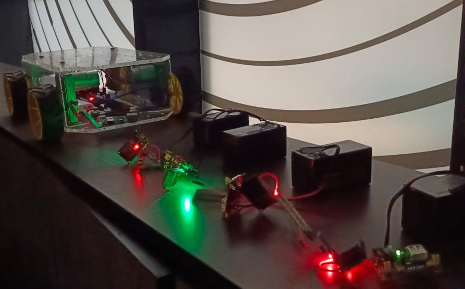

# Project AgBot
## Description
AgBot is an advanced robot equipped with wheels using Raspberry Pi and Arduino Uno boards. Designed for data collection, it can traverse various terrains to gather valuable information. With its sensors, AgBot captures ground data, which it efficiently transmits to a central server for analysis and further decision-making. It also has a camera that can be used to capture images and videos of the surroundings.<br><br>
Created while working as a Teaching Assistant for the Young Technology Scholar Program, 2023 at Plaksha University.

## Components Used
- Arduino Uno (and cable)
- Raspberry Pi 3B+
- 12V Battery
- Power Bank (any source to power the Raspberry Pi)
- 4 Wheels
- Jumper Wires
- LogiTech WebCam
- 2 IBT-2 H-Bridge
- 4 Motor
- Soldering Equipment
- 4 Acrylic Chassis
- 4 DC Motors
- ESP32 
- Breadboard Power Supply
- Soil Resistive Moisture Sensors

**You can find the relevant dimensions and models for components in the ```components/``` directory.**

_It is not necessary to use the exact same components_
## Pre-requisites (optional)
- Arduino IDE
- VS Studio Code
## Final Look
The final AgBot, along with the soil sensors, looks like this:
<center>

</center>

## References
We made most of the AgBot from the scratch, but did refer to the following resources:

- [Raspberry Pi Webcam Server and Stream Live Video](https://www.instructables.com/How-to-Make-Raspberry-Pi-Webcam-Server-and-Stream-/)

- [Green Analysis and Image Masking](https://www.tutorialspoint.com/how-to-mask-an-image-in-opencv-python)